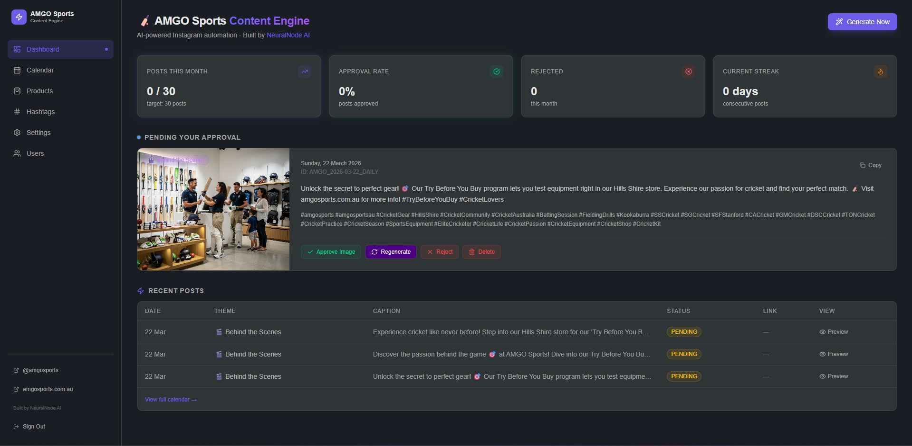
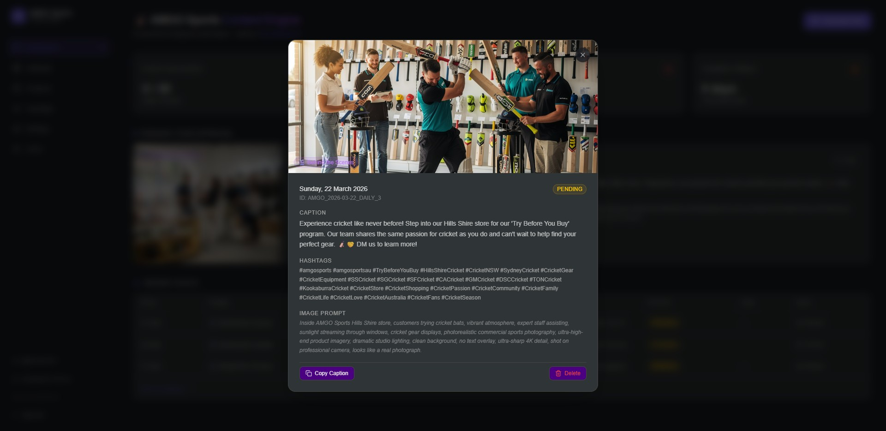
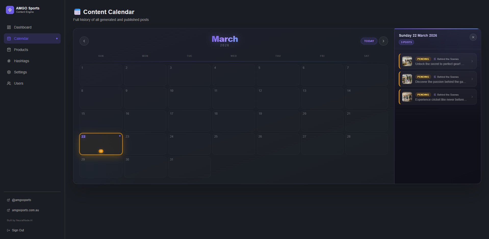
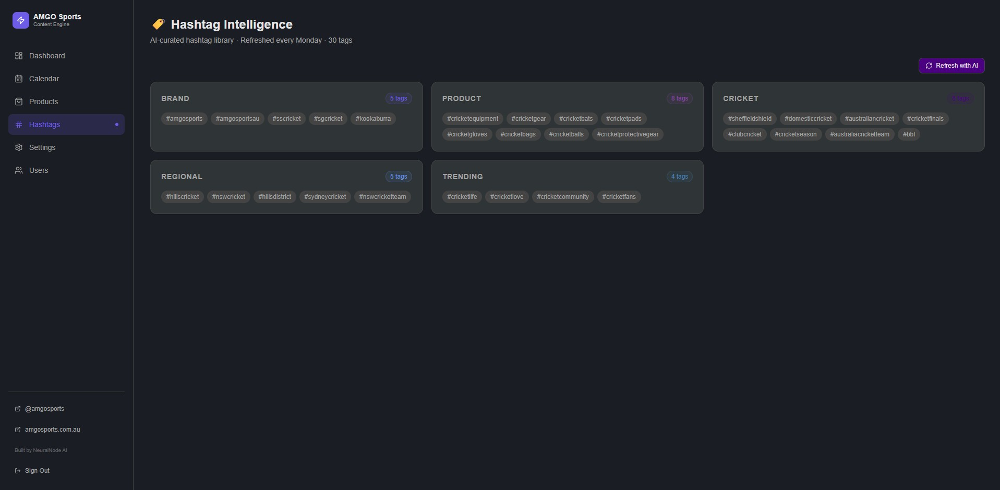
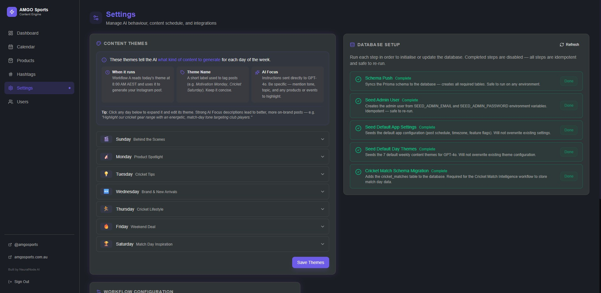

# AMGO Sports Content Engine — Dashboard Documentation

> **Built by [NeuralNode AI](https://neuralnodeai.com) for AMGO Sports**

This document is the complete reference for the AMGO Sports Content Engine web dashboard — every page, every panel, every button, and how they connect to the underlying automation.

---

## Table of Contents

1. [Overview](#1-overview)
2. [Navigation & Layout](#2-navigation--layout)
3. [Dashboard Home (`/`)](#3-dashboard-home-)
   - [Stats Row](#31-stats-row)
   - [Pending Approval Card](#32-pending-approval-card)
   - [Post Detail Modal](#33-post-detail-modal)
   - [Recent Posts Table](#34-recent-posts-table)
   - [Generate Now Button](#35-generate-now-button)
4. [Content Calendar (`/calendar`)](#4-content-calendar-calendar)
   - [Calendar Grid](#41-calendar-grid)
   - [Day Detail Panel](#42-day-detail-panel)
5. [Products (`/products`)](#5-products-products)
6. [Hashtag Intelligence (`/hashtags`)](#6-hashtag-intelligence-hashtags)
7. [Settings (`/settings`)](#7-settings-settings)
   - [Content Themes](#71-content-themes)
   - [Database Setup](#72-database-setup)
   - [Workflow Configuration](#73-workflow-configuration)
8. [Users (`/users`)](#8-users-users)
9. [Post Status Lifecycle](#9-post-status-lifecycle)
10. [Action Reference](#10-action-reference)
11. [Automation Schedule](#11-automation-schedule)

---

## 1. Overview

The dashboard is the human-in-the-loop control centre for the entire Instagram automation. Every morning at 8:00 AM AEST, AI generates a new post and sends a Telegram preview. You open the dashboard, review the post, and click one button to publish it to Instagram.

**Daily workflow in under 60 seconds:**

1. Receive Telegram notification at 8:00 AM AEST with post preview
2. Open dashboard → review image, caption, and hashtags
3. Click **Approve Image** (publishes to Instagram) or **Regenerate** (generates a new version)
4. Done — Blotato schedules the post to Instagram automatically

Everything else (cricket detection, hashtag refresh, Shopify sync, post expiry) runs fully automatically.

---

## 2. Navigation & Layout

The sidebar is present on all pages and contains:

| Item | Route | Purpose |
|------|-------|---------|
| Dashboard | `/` | Home — stats, pending approval, recent posts |
| Calendar | `/calendar` | Full monthly calendar of all posts |
| Products | `/products` | Shopify product library |
| Hashtags | `/hashtags` | AI hashtag library by category |
| Settings | `/settings` | Themes, database, workflow config |
| Users | `/users` | User management (Admin only) |

The footer of the sidebar shows:
- **@amgosports** — Instagram handle link
- **amgosports.com.au** — store website link
- **Built by NeuralNode.AI** — attribution
- **Sign Out** — ends the session

The **Generate Now** button (rocket icon, top-right header) is available on every page and immediately triggers Workflow A to generate a new post outside of the scheduled 8:00 AM run.

---

## 3. Dashboard Home (`/`)

The primary daily-use page. Designed to allow post review and approval in under 60 seconds.



### 3.1 Stats Row

Four metric cards displayed at the top of the page:

| Card | What It Measures | Target |
|------|-----------------|--------|
| **Posts This Month** | Total posts generated this calendar month | 30 (one per day) |
| **Approval Rate** | Percentage of generated posts approved and published | Higher = better |
| **Rejected** | Number of posts rejected this month | Quality control metric |
| **Current Streak** | Consecutive days with a published post | Consistency metric |

These stats are fetched live from `/api/stats` and reflect the current state of the PostgreSQL database.

### 3.2 Pending Approval Card

Appears when one or more posts have `PENDING` status. This is the most important element on the page.

**Card contents:**

- **Full-size image preview** — the DALL-E 3 generated image (1024×1024, hosted on imgbb)
- **Date & Post ID** — e.g. `Sunday, 22 March 2026 · ID: AMGO_2026-03-22_DAILY`
- **Caption** — full Instagram caption (200–280 characters, GPT-4o generated)
- **Hashtags** — all 25 AI-generated hashtags for the post
- **Copy button** — copies caption + hashtags to clipboard in one click

**Action buttons:**

| Button | What Happens |
|--------|-------------|
| ✅ **Approve Image** | Publishes the image post to Instagram via Blotato; status → `POSTED` |
| ✏️ **Regenerate** | Triggers Workflow A again with the same theme; replaces the current pending post |
| ❌ **Reject** | Marks the post as `REJECTED`; no content is published |
| 🗑️ **Delete** | Permanently removes the post from the database |

> **Note on match days:** On Australian cricket match days, two pending posts appear — a `_DAILY` post (regular theme) and a `_MATCH` post (Match Day Inspiration). Each has its own approval card and can be actioned independently.

### 3.3 Post Detail Modal

Click anywhere on a post card (or click the **Preview** link in the Recent Posts table) to open the full post detail modal.



**Modal contents:**

- **Large image** — full-resolution preview
- **Date, Post ID, and Status badge** (e.g. `PENDING`, `POSTED`)
- **Caption** — complete caption text with all formatting
- **Hashtags** — full list of all hashtags for the post
- **Image Prompt** — the exact DALL-E 3 prompt used to generate the image (useful for reference when certain visual styles produce great results)
- **Copy Caption** button — copies caption + hashtags to clipboard
- **Delete** button — permanently removes the post

### 3.4 Recent Posts Table

A table showing the **last 5 posts** sorted newest first.

| Column | Description |
|--------|-------------|
| **Date** | Post date |
| **Theme** | Daily content theme (e.g. Behind the Scenes, Product Spotlight) |
| **Caption** | Truncated preview of the caption text |
| **Status** | Current status badge: `PENDING` / `POSTED` / `REJECTED` / `EXPIRED` / `FAILED` |
| **Link** | Instagram post URL (populated after publishing) |
| **View** | Opens the post detail modal |

Click **View full calendar →** at the bottom to navigate to the full Content Calendar.

### 3.5 Generate Now Button

Located in the top-right header on every page.

- Immediately triggers **Workflow A** outside of the scheduled 8:00 AM run
- Useful for: generating a post on a day it was missed, testing after configuration changes, or generating an extra post
- After triggering, a Telegram notification arrives within 1–2 minutes with the new post preview
- The new post then appears in the **Pending Approval** section of the dashboard

---

## 4. Content Calendar (`/calendar`)

Full history of every post ever generated, displayed as a monthly calendar grid.



### 4.1 Calendar Grid

- **Monthly view** — navigate between months using the `←` / `→` arrows
- **Today button** — jumps back to the current month
- Each day cell shows a coloured dot indicator when posts exist for that date
- Click any day that has posts to open the **Day Detail Panel**

### 4.2 Day Detail Panel

Opens on the right side of the screen when a day with posts is selected.

- Shows the date heading (e.g. `Sunday 22 March 2026`) and post count badge (e.g. `3 POSTS`)
- Lists all posts for that day, each showing:
  - Thumbnail image
  - Status badge (`PENDING`, `POSTED`, etc.)
  - Theme name (e.g. `Behind the Scenes`)
  - Caption preview
  - Arrow to expand the full post detail

**Use cases for the Calendar:**
- Review what was posted in previous weeks or months
- Look up the DALL-E prompt that generated a great image (for reference)
- Find the Instagram link for a specific date's post
- Check whether any posts were missed (no dot = no content that day)
- Review the full history of rejected and expired posts

---

## 5. Products (`/products`)

Displays the product library synced from the AMGO Sports Shopify store.

**Product card contents:**
- Product image (from Shopify CDN)
- Product title and brand/vendor
- Price
- **Feature** button — instantly triggers Workflow A to generate a **Product Spotlight** post for that specific product
- **External link** to the product page on amgosports.com.au

**Sync from Shopify button** (top-right) — manually triggers **Workflow C** to re-fetch all active products from Shopify and update the database. Normally this runs automatically every Sunday at 6:00 AM AEST.

**Use cases:**
- Manually create a Product Spotlight post for a new or featured product at any time
- Verify the product library is up to date after adding new stock to Shopify
- Browse all synced products without going to the Shopify admin

---

## 6. Hashtag Intelligence (`/hashtags`)

Displays the current AI-curated hashtag library, organised into 5 categories.



**Header info:**
- `AI-curated hashtag library · Refreshed every Monday · 30 tags`
- Total of 30 hashtags across all categories, replaced in full each Monday at 7:00 AM AEST

**Categories:**

| Category | Count | Purpose | Example Tags |
|----------|-------|---------|--------------|
| **Brand** | 5 | AMGO-specific brand identity | `#amgosports`, `#amgosportsau`, `#kookaburra` |
| **Product** | 8 | Cricket equipment types | `#cricketequipment`, `#cricketgear`, `#cricketballs`, `#cricketpads` |
| **Cricket** | 8 | Sport and competition tags | `#domesticcricket`, `#australiancricket`, `#bbllive`, `#cricketseason` |
| **Regional** | 5 | NSW/Sydney/Hills District geo-tags | `#hillscricket`, `#nswcricket`, `#sydneycricket` |
| **Trending** | 4 | Season-aware trending tags | `#cricketlife`, `#cricketlove`, `#cricketcommunity` |

**Refresh with AI button** (top-right) — manually triggers **Workflow E** to regenerate all 30 hashtags using GPT-4o-mini, which:
1. Checks upcoming cricket fixtures for seasonal context (BBL, Test, Sheffield Shield, off-season)
2. Generates a fresh set of 30 hashtags appropriate for the current time of year
3. Atomically replaces the entire library in one database transaction (no partial states)

**Use cases:**
- Verify hashtags are up to date and relevant for the current cricket season
- Trigger an early refresh if the season context changes (e.g. BBL finals just started)
- Review which hashtags are currently being appended to every post

---

## 7. Settings (`/settings`)

Configuration panel for the content engine. Changes here affect AI behaviour and system state.



### 7.1 Content Themes

The 7 daily content themes that tell the AI what kind of post to generate each day of the week.

| Day | Default Theme | AI Focus |
|-----|--------------|----------|
| **Sunday** | Behind the Scenes | Motivational — show behind-the-scenes of AMGO Sports store, team, or gear fitting |
| **Monday** | Product Spotlight | Product-focused — highlight a specific product from the Shopify catalogue |
| **Tuesday** | Cricket Tips | Educational — tips, drills, techniques for cricket players |
| **Wednesday** | Brand & New Arrivals | Brand awareness — new stock, brand partnerships, what's arrived in store |
| **Thursday** | Cricket Lifestyle | Lifestyle — the passion and culture around cricket, AMGO community |
| **Friday** | Weekend Deal | Promotional — highlight a deal or special offer ahead of the weekend |
| **Saturday** | Match Day Inspiration | Inspirational — energetic match-day content (doubles as a Match Day post theme) |

**How themes work:**
- Workflow A reads today's theme from these settings each morning before generating
- The theme is passed to GPT-4o as part of the prompt: theme name + AI Focus instructions
- You can edit any theme name and focus description, then click **Save Themes** to update
- The AI will incorporate the new instructions from the next generation onwards

> **Tip:** Click any theme row to expand it and edit the **Theme Name** and **AI Focus** description. Strong AI Focus descriptions lead to better, more consistent posts. Use specific language — mention tone, subject, products to highlight, and hashtag themes.

### 7.2 Database Setup

Displays the status of each one-time database initialisation step. These should all show **Complete** in a correctly configured deployment.

| Step | What It Does |
|------|-------------|
| **Schema Push** | Creates all required database tables via Prisma |
| **Seed Admin User** | Creates the admin account from `SEED_ADMIN_EMAIL` / `SEED_ADMIN_PASSWORD` env vars |
| **Seed Default App Settings** | Inserts default post schedule, timezone, and feature flags into the settings table |
| **Seed Default Day Themes** | Seeds the 7 default weekly content themes into the database |
| **Cricket Match Schema Migration** | Adds the `cricket_matches` table required for Workflow D |

If any step shows as incomplete, click **Refresh** to re-check status, or click the step's **Run** button to execute it. Steps that are already complete are greyed out and idempotent (safe to re-run).

### 7.3 Workflow Configuration

Displays and allows editing of the n8n webhook URLs and operational configuration for each workflow. This section connects the dashboard to the live n8n instance.

**Key configuration items:**
- n8n webhook paths for each workflow trigger
- Feature flag toggles (Telegram notifications, AI reel generation, auto-approve)
- Post timing configuration (note: must also update the n8n cron expression separately)

---

## 8. Users (`/users`)

Admin-only page for managing dashboard access.

**Actions available (Admin role only):**
- View all existing users with their roles and email addresses
- Create new users (email + password + role assignment)
- Assign roles: `ADMIN`, `EDITOR`, or `VIEWER`

**Role permissions:**

| Role | Can Do |
|------|--------|
| **ADMIN** | Full access — all pages, all actions, user management, settings |
| **EDITOR** | Approve, reject, regenerate posts; manage hashtags and products |
| **VIEWER** | Read-only — view posts, calendar, products, hashtags; no actions |

---

## 9. Post Status Lifecycle

Every post moves through these statuses:

```
Generated by Workflow A
         ↓
      PENDING
    ↙    ↓    ↘
POSTED REJECTED EXPIRED
                  ↑
           No action taken
           after 23 hours
           (Workflow F)
```

| Status | Meaning | Badge Colour |
|--------|---------|-------------|
| `PENDING` | Awaiting review and approval in dashboard | Amber |
| `POSTED` | Approved and published to Instagram via Blotato | Green |
| `REJECTED` | Manually rejected via dashboard | Red |
| `EXPIRED` | No action taken within 23 hours — auto-expired by Workflow F | Grey |
| `FAILED` | Publishing to Instagram failed in Workflow B | Red |

**Auto-expiry:** Workflow F runs every day at 7:50 AM AEST (10 minutes before Workflow A). It finds all `PENDING` posts older than 23 hours and marks them `EXPIRED`, then sends a Telegram summary of how many were expired. This ensures the dashboard never accumulates a backlog of stale pending posts.

---

## 10. Action Reference

Quick reference for every clickable action in the dashboard and what it triggers:

| Action | Location | API Call | n8n Workflow |
|--------|----------|----------|-------------|
| **Approve Image** | Pending card, Post modal | `POST /api/approve/[id]` | Workflow B (`approve`) |
| **Approve as Reel** | Pending card | `POST /api/approve/[id]` | Workflow B (`approve_reel`) |
| **Regenerate** | Pending card | `POST /api/approve/[id]` | Workflow B (`regenerate`) → Workflow A |
| **Reject** | Pending card, Post modal | `POST /api/reject/[id]` | Workflow B (`reject`) |
| **Delete** | Pending card, Post modal | `PATCH /api/posts/[id]` | — (DB update only) |
| **Generate Now** | Header (all pages) | `POST /api/generate` | Workflow A |
| **Feature Product** | Products page | `POST /api/generate` (with productId) | Workflow A (product spotlight) |
| **Sync from Shopify** | Products page | n8n webhook | Workflow C |
| **Refresh with AI** | Hashtags page | `POST /api/hashtags/refresh` | Workflow E |
| **Save Themes** | Settings page | `PUT /api/settings` | — (DB update only) |
| **Run DB Step** | Settings → DB Setup | `POST /api/admin/db-migrate` | — |

---

## 11. Automation Schedule

The full daily automation sequence (all times AEST):

| Time (AEST) | Time (UTC) | Workflow | What Happens |
|------------|-----------|----------|-------------|
| 7:30 AM daily | 21:30 UTC | **D — Cricket Monitor** | Checks CricAPI for Australian matches; sets `isMatchDay` flag for today |
| 7:50 AM daily | 21:50 UTC | **F — Post Expiry** | Expires any PENDING posts older than 23 hours |
| 8:00 AM daily | 22:00 UTC | **A — Content Generator** | Generates today's post (+ match day post if applicable); sends Telegram notification |
| 6:00 AM Sunday | 20:00 UTC Sat | **C — Shopify Sync** | Re-syncs all active Shopify products to the database |
| 7:00 AM Monday | 21:00 UTC Sun | **E — Hashtag Intelligence** | Regenerates all 30 hashtags based on current cricket season context |

**On a normal day:**
- 7:30 AM: D runs → no match today
- 7:50 AM: F runs → no stale posts
- 8:00 AM: A runs → 1 post generated (`AMGO_YYYY-MM-DD_DAILY`)
- ~8:01 AM: Telegram notification arrives with image preview
- Dashboard shows 1 PENDING post awaiting approval

**On a match day:**
- 7:30 AM: D runs → match detected, `isMatchDay = true`; Telegram alert sent: *"An additional Match Day post will be generated alongside today's regular theme post in 30 minutes."*
- 8:00 AM: A runs → 2 posts generated (`_DAILY` + `_MATCH`)
- Dashboard shows 2 PENDING posts, each with independent approve/reject actions

---

*Documentation maintained by [NeuralNode AI](https://neuralnodeai.com)*
